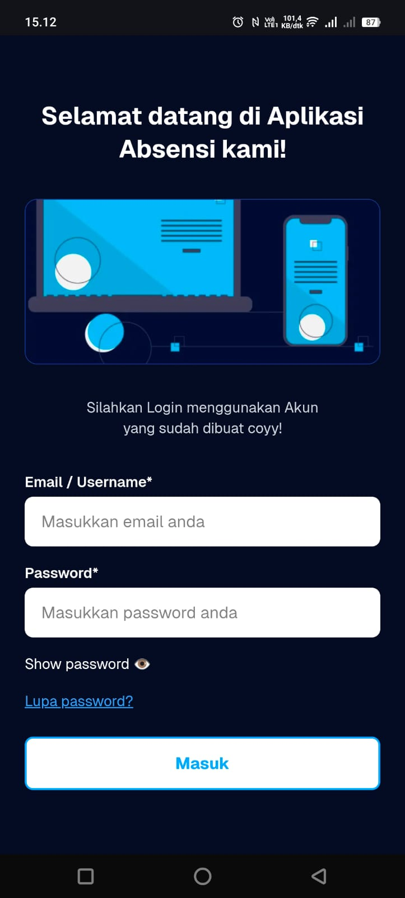
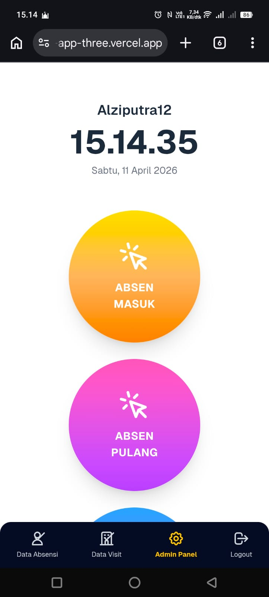
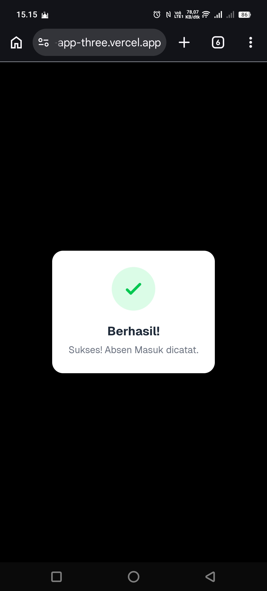
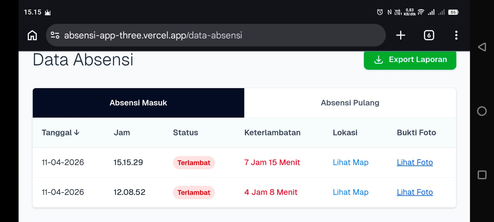
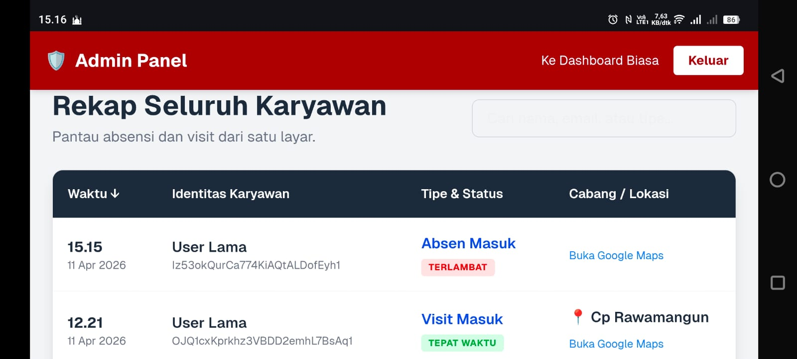

# ⚡ AppAbsensi - Smart Attendance & Visit Tracker


AppAbsensi adalah aplikasi pencatatan kehadiran dan kunjungan lapangan (Visit) berbasis web (PWA Ready) yang dirancang khusus untuk mobilitas tinggi. Dibangun menggunakan **Next.js** dan **Firebase**, aplikasi ini dilengkapi dengan pelacakan GPS, kompresi gambar sisi klien (*client-side*), dan Panel Admin terpusat.

---

## 🚀 Live Demo

Kamu dapat mencoba aplikasi ini secara langsung melalui tautan berikut:
🌐 **[https://absensi-app-three.vercel.app/]**

**Akun Demo (User Biasa):**
> **Email:** `user@tester.com`
> **Password:** `tester123`

*(Catatan: Untuk mengakses halaman Admin Panel, diperlukan email khusus yang telah didaftarkan sebagai Super Admin di dalam *source code*).*

---

## 📸 Tampilan Aplikasi


<div align="center">
  
  
  
  
  
</div>

---

## ✨ Fitur Utama (Core Features)

Aplikasi ini dibagi menjadi dua modul utama: **Karyawan (User)** dan **Manajemen (Admin)**.

### 👤 Karyawan (User App)
- **Clock-In / Clock-Out Cerdas:** Mencegah karyawan melakukan "Absen Pulang" jika belum melakukan "Absen Masuk" di hari yang sama.
- **Deteksi Keterlambatan Otomatis:** Sistem secara otomatis mendeteksi status "Terlambat" jika absen masuk dilakukan di atas jam 08:00 pagi beserta detail durasi keterlambatannya.
- **Multi-Visit Tracker:** Fitur khusus untuk orang lapangan (Sales/Kurir) untuk mencatat kunjungan ke berbagai Cabang/Outlet dalam satu hari.
- **Geo-Tagging (GPS):** Mengambil koordinat lintang & bujur secara presisi yang otomatis terkonversi menjadi tautan Google Maps.
- **Client-Side Image Compression:** Mengecilkan ukuran foto secara otomatis di *browser* (dari >5MB menjadi <500KB) sebelum diunggah ke *server*, menghemat kuota data dan biaya penyimpanan Firebase.
- **Dynamic Loading UI:** Pop-up interaktif untuk memberikan *feedback* proses kepada pengguna.

### 🛡️ Admin Panel & Reporting
- **Role-Based Access Control (RBAC):** Proteksi berlapis yang menolak akses pengguna biasa ke halaman admin.
- **Real-time Monitoring:** Memantau seluruh aktivitas absensi dan visit karyawan dalam satu layar utama.
- **Smart Search:** Fitur pencarian instan berdasarkan Nama, Email, atau Tipe Absensi.
- **One-Click Export to CSV:** Menggabungkan data "Masuk" dan "Pulang" ke dalam satu baris tabel Excel yang rapi, siap untuk laporan HRD bulanan.

---

## 🛠️ Tech Stack

- **Framework:** [Next.js (App Router)](https://nextjs.org/)
- **Styling:** [Tailwind CSS](https://tailwindcss.com/)
- **Database:** Firebase Firestore
- **Storage:** Firebase Cloud Storage
- **Authentication:** Firebase Auth
- **Image Processing:** `browser-image-compression`

---

## 💻 Getting Started (Local Development)

Jika ingin menjalankan atau memodifikasi proyek ini di komputer kamu sendiri caranya:

### 1. Clone Repository
```bash
git clone https://github.com/alziputra/absensi-app.git
cd absensi-app
```

### 2. Install Dependencies
```Bash
npm install
# or
yarn install
```

### 3. Setup Firebase Config

Buat file `.env` di _root folder_ dan masukkan konfigurasi Firebase kamu:


```
NEXT_PUBLIC_FIREBASE_API_KEY=your_api_key
NEXT_PUBLIC_FIREBASE_AUTH_DOMAIN=your_auth_domain
NEXT_PUBLIC_FIREBASE_PROJECT_ID=your_project_id
NEXT_PUBLIC_FIREBASE_STORAGE_BUCKET=your_storage_bucket
NEXT_PUBLIC_FIREBASE_MESSAGING_SENDER_ID=your_messaging_sender_id
NEXT_PUBLIC_FIREBASE_APP_ID=your_app_id
```

### 4. Jalankan Server

Bash

```
npm run dev
# or
yarn dev
```

Buka [http://localhost:3000] di _browser_ untuk melihat hasilnya.

---

## 📝 Konfigurasi Admin

Untuk menjadikan sebuah akun sebagai Admin, tambahkan email tersebut ke dalam file `src/constants.js`:

JavaScript

```
export const ADMIN_EMAILS = [
  "admin@perusahaan.com",
  "email_anda@domain.com"
];
