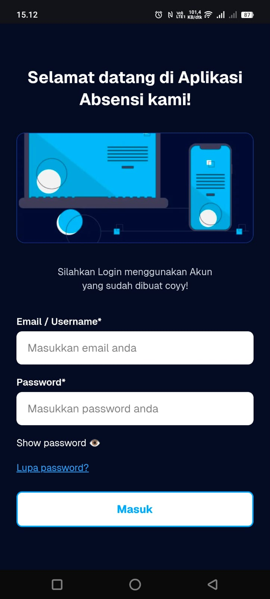
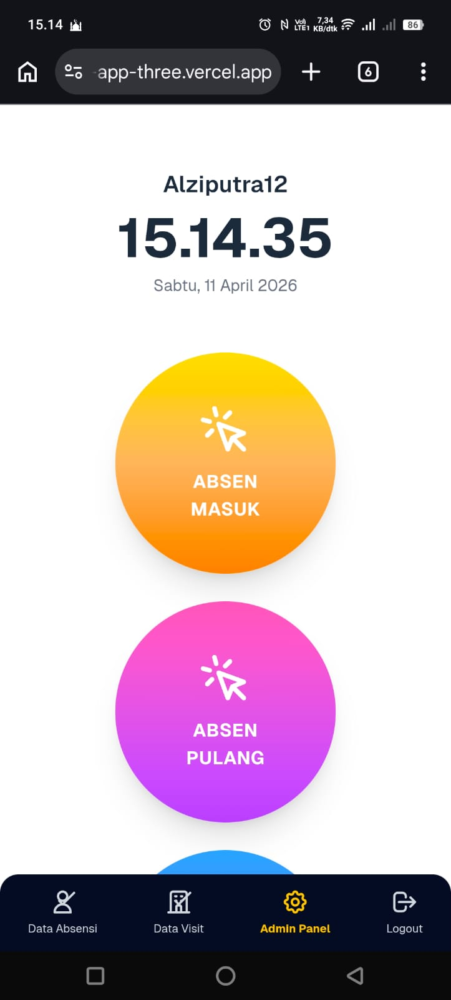
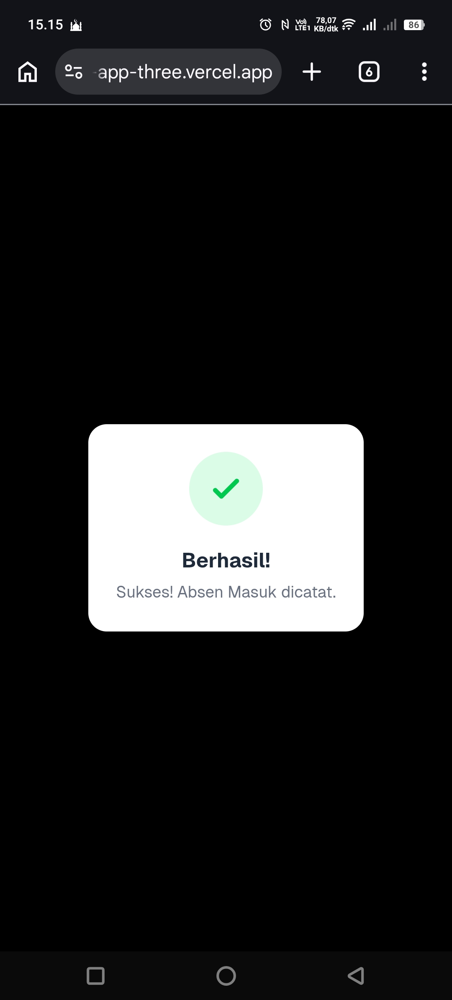
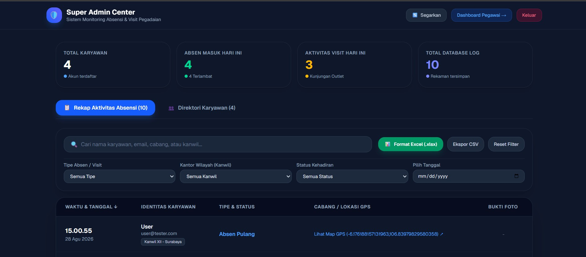
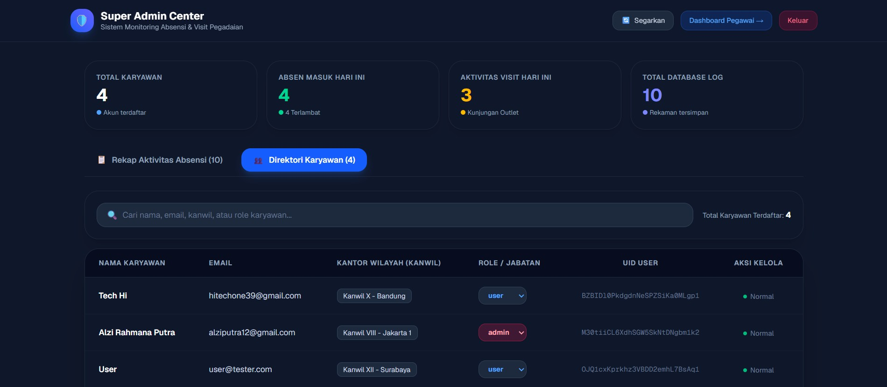

# ⚡ AppAbsensi - Enterprise Smart Attendance & Visit Tracker


**AppAbsensi** adalah aplikasi pencatatan kehadiran (Absensi) dan kunjungan outlet/cabang lapangan (*Visit Tracker*) tingkat *enterprise* berbasis web (PWA Ready) yang dirancang khusus untuk mobilitas tinggi (Desktop Support, Petugas Lapangan, Sales, dan Tenaga Alih Daya Pegadaian / Manage Service).

Dibangun dengan arsitektur modern **Next.js (App Router)**, **TypeScript**, **Tailwind CSS v4**, dan **Firebase Cloud**, dilengkapi pelacakan GPS akurat, generator laporan resmi Excel (`.xlsx`), sistem verifikasi reset password *on-demand*, dan Panel Super Admin terpusat dengan performa tinggi.

---

## 🚀 Live Demo

- **URL Aplikasi:** [https://absensi-app-three.vercel.app/](https://absensi-app-three.vercel.app/)
- **Akun Demo (Karyawan):**
  > **Email:** `user@tester.com`  
  > **Password:** `tester123`

*(Catatan: Untuk masuk ke Super Admin Center, gunakan akun email yang telah didaftarkan pada file `src/config/constants.ts`).*

---

## 📸 Tampilan Aplikasi

<div align="center">
  
  
  
  
  
</div>

---

## ✨ Fitur-Fitur Utama (Core Features)

### 👤 Modul Karyawan (Employee Portal)
- **1-Click Absensi GPS Instan:** Absen Masuk dan Absen Pulang cepat tanpa beban upload foto, otomatis mengunci titik koordinat GPS.
- **Anti-Double & Flow Validation:** Mencegah absen ganda di hari yang sama dan memblokir absen pulang jika belum absen masuk.
- **Deteksi Keterlambatan Otomatis:** Sistem mendeteksi otomatis jika absen masuk melewati pukul 08:00 beserta kalkulasi durasi keterlambatan.
- **Multi-Visit Tracker Lapangan:** Pencatatan kunjungan ke outlet/cabang dengan bukti foto (otomatis terkompresi < 500KB) dan koordinat GPS.
- **Official Excel (.xlsx) Report Exporter:**
  - Export laporan format resmi **"ABSENSI MANAGE SERVICE - Layanan Kantor Wilayah"**.
  - Pilihan cepat rentang tanggal cut-off payroll:
    - ⚡ `21 Lalu - 20 Ini` (Standar 21 bulan lalu s/d 20 bulan ini)
    - ⚡ `13 Lalu - 12 Ini` (Standar 13 bulan lalu s/d 12 bulan ini)
    - ⚡ `1 - Akhir Bln` (Bulan berjalan)
  - Otomatis menghitung selisih jam kerja (`H:mm`), menandai akhir pekan (Sabtu/Minggu) dengan blok warna pink/magenta, dan menyusun garis sel tabel yang presisi.
- **Self-Service Permintaan Reset Password:** Form lupa password yang langsung meneruskan permohonan ke Super Admin.

### 🛡️ Modul Super Admin (Super Admin Center)
- **Role-Based Access Control (RBAC):** Proteksi halaman admin dengan feedback modal informatif & santai.
- **Executive KPI Cards:** Ringkasan statistik cepat (Total Karyawan, Absen Masuk Hari Ini, Rasio Terlambat, Total Kunjungan Visit, Total Log).
- **Multi-Filter & Live Search:** Filter data berdasarkan Kanwil Pegadaian, Tipe Absen, Status Kehadiran, dan Tanggal Spesifik.
- **Pagination Cepat:** Navigasi data 10, 25, 50, hingga 100 baris per halaman untuk mendukung ribuan record.
- **Direktori Karyawan & On-Demand Password Reset Approval:**
  - Master data akun seluruh karyawan.
  - Tombol **`🔑 Kirim Link Reset`** hanya muncul jika karyawan mengajukan reset dari aplikasi, menjaga privasi dan keamanan akun.
- **Master Export:** Dukungan export laporan Master CSV dan format resmi Excel `.xlsx`.

---

## 🛠️ Tech Stack & Dependencies

| Kategori | Teknologi | Deskripsi |
| :--- | :--- | :--- |
| **Framework** | [Next.js 16 (App Router)](https://nextjs.org/) | Server & Client Components modern |
| **Language** | [TypeScript 5](https://www.typescriptlang.org/) | Strict Type Safety di seluruh codebase |
| **Styling** | [Tailwind CSS v4](https://tailwindcss.com/) | Styling responsif berkinerja tinggi |
| **Authentication** | [Firebase Auth](https://firebase.google.com/docs/auth) | Manajemen sesi pengguna & email reset password |
| **Database** | [Firebase Firestore](https://firebase.google.com/docs/firestore) | Database NoSQL real-time terdistribusi |
| **Cloud Storage** | [Firebase Cloud Storage](https://firebase.google.com/docs/storage) | Penyimpanan file bukti foto per user |
| **Excel Generator** | [ExcelJS](https://github.com/exceljs/exceljs) | Pembuatan file `.xlsx` dengan rich cell styling |
| **Image Optimizer** | [browser-image-compression](https://www.npmjs.com/package/browser-image-compression) | Kompresi foto sisi klien (< 500KB) |

---

## 📦 Setup & Instalasi Lokal

### 1. Clone Repository
```bash
git clone https://github.com/alziputra/absensi-app.git
cd absensi-app
```

### 2. Install Dependencies
```bash
npm install
```

### 3. Konfigurasi Environment Variables
Buat file baru bernama `.env`:

Isi dengan kredensial Firebase Project Anda:
```env
NEXT_PUBLIC_FIREBASE_API_KEY=your_api_key
NEXT_PUBLIC_FIREBASE_AUTH_DOMAIN=your_project.firebaseapp.com
NEXT_PUBLIC_FIREBASE_PROJECT_ID=your_project_id
NEXT_PUBLIC_FIREBASE_STORAGE_BUCKET=your_project.appspot.com
NEXT_PUBLIC_FIREBASE_MESSAGING_SENDER_ID=your_sender_id
NEXT_PUBLIC_FIREBASE_APP_ID=your_app_id
```

### 4. Manajemen Role & Hak Akses (2 Roles: `admin` & `user`)
Aplikasi menggunakan sistem 2 role berbasis database Firestore:
- **`user`**: Role default saat karyawan mendaftar akun baru (dapat melakukan absen masuk/pulang, visit, dan export laporan pribadi).
- **`admin`**: Memiliki hak akses penuh ke Super Admin Center (monitoring seluruh karyawan, reset password approval, dan ubah role pengguna).

**Cara Menentukan / Mengubah Role Admin:**
1. **Via Admin Panel**: Buka tab *👥 Direktori Karyawan* di Super Admin Center, lalu ubah dropdown role user menjadi `admin` atau `user`.
2. **Via Firebase Console**: Buka dokumen user di `absensi-app/{userId}` dan ubah field `role` menjadi `"admin"` (atau `"user"`).

### 5. Jalankan Server Development
```bash
npm run dev
```
Buka [http://localhost:3000](http://localhost:3000) di browser.


## 📄 Lisensi

Proyek ini dikembangkan untuk kebutuhan internal pengelolaan absensi & operasional lapangan.  
Dikelola oleh **Alzi Rahmana Putra**
